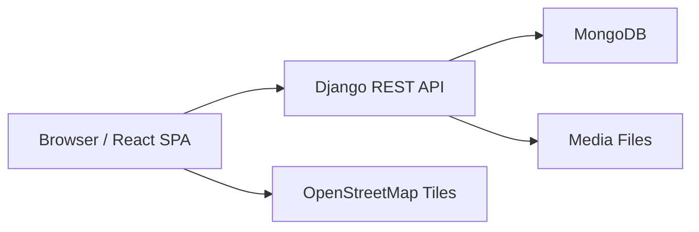

# Technical Architecture

This document describes the technical design of MedaPlus at a system level.

## System Overview

MedaPlus uses a client-server architecture:

- The frontend is a React single page application served by Vite.
- The backend is a Django REST API.
- MongoDB stores users, tenants, pitches, slots, and bookings.
- Uploaded pitch images are stored under the Django `media/` directory in development.



## Runtime Components

### Frontend Application

Location: `frontend/`

The frontend is responsible for:

- Rendering route-level screens.
- Managing JWT tokens in `localStorage`.
- Calling backend APIs through the shared Axios client.
- Showing pitch discovery, map views, admin approval screens, owner dashboards, and pitch booking screens.
- Building multipart form payloads for pitch creation and image uploads.

Important files:

- `frontend/src/main.tsx`: React entry point and route configuration.
- `frontend/src/lib/api.ts`: Shared Axios instance, auth header injection, token refresh handling.
- `frontend/src/lib/auth.ts`: Login, registration, current-user helpers.
- `frontend/src/lib/pitches.ts`: Pitch, booking, owner approval, and admin API helpers.
- `frontend/src/pages/App.tsx`: Player dashboard and pitch discovery.
- `frontend/src/pages/Admin.tsx`: Admin dashboard for owner and pitch approvals.
- `frontend/src/pages/Owner.tsx`: Owner dashboard.
- `frontend/src/pages/PitchDetail.tsx`: Pitch detail, availability, and booking flow.
- `frontend/src/components/PitchWizardModal.tsx`: Pitch create/edit wizard.

### Backend Application

Location: `backend/`

The backend is responsible for:

- Authentication and role-based authorization.
- Owner registration and approval.
- Tenant and pitch management.
- Pitch approval and public visibility rules.
- Slot availability generation.
- Booking creation and slot status updates.
- Serving uploaded media during development.

Important files:

- `backend/config/settings.py`: Django settings, database, installed apps, REST framework, CORS, media.
- `backend/config/urls.py`: Top-level API route wiring.
- `backend/accounts/models.py`: Custom user model and role definitions.
- `backend/accounts/views.py`: Auth profile, registration, owner approval endpoints.
- `backend/pitches/models.py`: Tenant, Pitch, PitchImage, and booking type definitions.
- `backend/pitches/views.py`: Pitch listing, creation, detail, update, approval, and availability generation.
- `backend/bookings/models.py`: Slot and Booking models.
- `backend/bookings/views.py`: Booking creation and slot occupancy logic.

## Domain Model

### User

Defined in `accounts.User`.

Roles:

- `ADMIN`: Can approve owners and pitches. Can manage all pitches.
- `OWNER`: Can create and manage pitches for their tenant after account approval.
- `PLAYER`: Can browse approved pitches and create bookings.

Important fields:

- `role`
- `is_approved`
- standard Django auth fields such as `username`, `email`, `password`

### Tenant

Defined in `pitches.Tenant`.

A tenant represents a pitch business or organization. The current model is one owner to one tenant.

Important fields:

- `name`
- `owner`
- `phone`
- `is_active`
- `is_approved`

### Pitch

Defined in `pitches.Pitch`.

A pitch belongs to a tenant and contains pricing, location, operating hours, amenities, and approval state.

Important fields:

- `tenant`
- `name`
- `latitude`
- `longitude`
- `address`
- `opening_time`
- `closing_time`
- `hourly_price`
- `weekly_price`
- `monthly_price`
- `allow_hourly`
- `allow_weekly`
- `allow_monthly`
- `is_approved`
- `is_active`

### PitchImage

Defined in `pitches.PitchImage`.

Stores one uploaded file per pitch image.

### Slot

Defined in `bookings.Slot`.

A slot represents a concrete time range for a pitch.

Statuses:

- `AVAILABLE`
- `BLOCKED`
- `BOOKED`

### Booking

Defined in `bookings.Booking`.

A booking records one selected time range. Multiple selected slots in one request share a generated booking code.

Statuses:

- `PENDING`
- `CONFIRMED`
- `CANCELLED`

## Authentication Flow

1. User logs in through `POST /api/auth/login/`.
2. Backend returns access and refresh JWT tokens.
3. Frontend stores both tokens in `localStorage`.
4. `frontend/src/lib/api.ts` attaches the access token to protected API calls.
5. If the backend returns `401`, the frontend tries `POST /api/auth/refresh/`.
6. If refresh succeeds, the failed request is retried.
7. If refresh fails, tokens are cleared and the user is redirected to `/login`.

## Role and Approval Flow

### Player

1. Player signs up.
2. Player is approved immediately.
3. Player can browse only active and approved pitches from active and approved tenants.
4. Player can create normal bookings.

### Owner

1. Owner signs up.
2. Owner account starts as not approved.
3. A tenant is created for the owner.
4. Admin approves the owner.
5. Owner can create pitches.
6. Created pitches start as not approved.
7. Admin approves pitches before players can see them.

### Admin

1. Admin user is created through Django superuser flow.
2. Superusers are automatically assigned the `ADMIN` role in `accounts.User.save`.
3. Admin can approve owners.
4. Admin can approve pitches.
5. Admin can create and edit pitches for owners.

## Pitch Visibility Rules

A player can see a pitch only when all of the following are true:

- `pitch.is_active` is true.
- `pitch.is_approved` is true.
- `pitch.tenant.is_active` is true.
- `pitch.tenant.is_approved` is true.

Owners can see their own tenant pitches even if pitch approval is pending.

Admins can see all pitches.

## Booking Flow

1. User opens a pitch detail page.
2. Backend returns pitch data, generated availability, monthly weeks, and existing bookings visible to managers.
3. User selects one or more available slots.
4. Frontend submits selected `start_iso` and `end_iso` values to `POST /api/bookings/`.
5. Backend validates permissions and slot availability.
6. Backend creates missing slots if needed.
7. Backend marks selected slots as `BOOKED`.
8. Backend creates confirmed booking records with a shared booking code.
9. Frontend refreshes pitch detail data.

Managers can create manual cash bookings by sending `manual_cash=true`. Players are not allowed to create manual cash bookings.

## Availability Generation

Availability is generated in `backend/pitches/views.py`.

For each day:

1. The backend uses `pitch.opening_time.hour` as the start hour.
2. The backend uses `pitch.closing_time.hour` as the end hour.
3. It builds one-hour slots between those values.
4. Existing slots are merged into the generated view.
5. Past slots are marked as unavailable.

Daily and weekly views use the next seven days. Monthly view generates four weeks starting from the current local date.

## API Boundaries

The frontend should use the helpers in `frontend/src/lib/` rather than calling Axios directly from pages when practical. This keeps route components focused on UI state and keeps API path changes contained.

The backend currently uses function-based DRF views. Permission checks are implemented inside view functions and through DRF permission decorators.

## Data Storage

The backend uses MongoDB through `django_mongodb_backend`.

The main database settings are:

- `MONGODB_URI`
- `MONGODB_NAME`

Uploaded pitch images are saved through Django's `FileField` under:

```text
backend/media/pitch_images/
```

For production, media storage should be moved to durable object storage or another managed file storage strategy.

## Deployment Architecture

The root `ecosystem.config.cjs` defines two PM2 processes:

- `meda-backend`: runs `python manage.py runserver 0.0.0.0:7000`
- `meda-frontend`: runs `npm run dev -- --host 0.0.0.0 --port 5174`

This is useful for a simple development or staging server. For production, consider:

- Running Django with a production WSGI/ASGI server.
- Serving the frontend as a static Vite build.
- Placing a reverse proxy such as Nginx in front of both services.
- Using production-grade media storage.
- Locking down CORS, allowed hosts, and secrets.

## Configuration Risks To Review

The current settings file reads some values from the environment, but later hardcodes development defaults for `SECRET_KEY` and `DEBUG`. Before production deployment, these should be fully environment-driven.

The repository also contains generated files such as `__pycache__` and backup files with `_old` suffixes. These should be cleaned up when the team is ready.

## Recommended Next Steps

- Consider moving backend dependency management to a `pyproject.toml` if the project grows.
- Add automated tests for approval and booking conflict rules.
- Add a production deployment guide once the hosting target is finalized.
- Add API examples for common frontend calls.
- Add a database backup and restore procedure.
